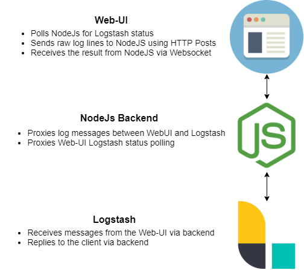
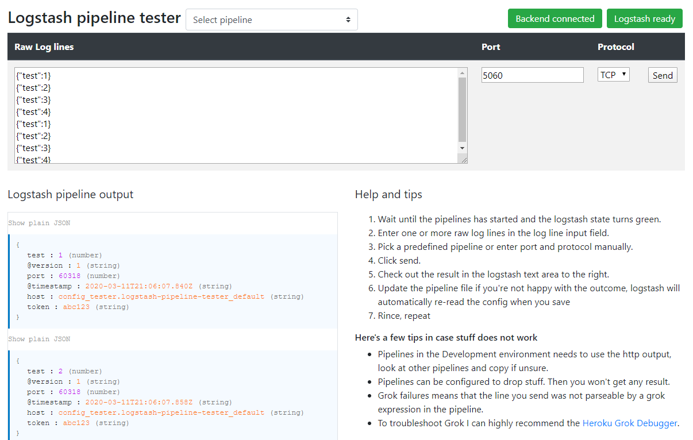

# About
This started out as a way to make it easy to test the logstash configuration for people without much linux know-how (and from my own frustration with how hard it was). Then it kind of grew into an interface, and here we are.

It's written fast and the code could use a bit of additional love, but it works fine.

# How to start
Documentation on how to get going is available here:
https://loadbalancing.se/2020/03/11/logstash-pipeline-tester/

There's also a video of how to get started here:
https://youtu.be/Q3IQeXWoqLQ

Article is dated 2020 but is continously updated whenever there is need to do so.

# Contribute
I gladly accept pull requests. If you have a pipeline you'd like to share/contribute that'd be great too.
If you don't know how to do forking and pull requests I can handle that part, just let me know via an issue
or dig up my contact details [here](https://loadbalancing.se/about/).

## Contributing to the application (Express/React)

### Prerequisites
- Node.js >= 22
- Docker (or Podman 4.0+ with podman-compose 1.x)
- Windows: Docker (WSL2)

### Install dependencies
```sh
make install
```

Or manually:
```sh
npm install --prefix pipeline-ui
npm install --prefix pipeline-ui/backend
npm install --prefix pipeline-ui/frontend
```

### Start the development environment

**Full stack** (Logstash + Backend + Frontend):
```sh
make dev
```

**Backend + Frontend only** (faster, when you don't need Logstash):
```sh
make dev-ui
```

Or start each component manually in separate terminals:
```sh
# Terminal 1 — Logstash
BACKEND_ENDPOINT=http://host.docker.internal:8080/api/v1/receiveLogstashOutput docker compose up logstash

# Terminal 2 — Backend
npm run dev --prefix pipeline-ui/backend

# Terminal 3 — Frontend
npm run dev --prefix pipeline-ui/frontend
```

Frontend is served at `http://localhost:3000`, backend at `http://localhost:8080`. Both modes support hot-reload.

### Lint and test

```sh
make lint   # Oxlint (frontend) + ESLint (backend)
make test   # Cypress integration tests — requires the app to be running first
```

Or manually:
```sh
npm run lint --prefix pipeline-ui/frontend
npm run lint --prefix pipeline-ui/backend
npm start --prefix pipeline-ui/integration-tests
```

### All available Make targets
```sh
make help
```

| Target | Description |
|---|---|
| `make dev` | Start all services (Logstash, Backend, Frontend) |
| `make dev-ui` | Start Backend + Frontend only |
| `make dev-logstash` | Start Logstash only |
| `make dev-backend` | Start Backend only |
| `make dev-frontend` | Start Frontend only |
| `make lint` | Lint frontend and backend |
| `make test` | Run integration tests |
| `make stop` | Stop all services and Docker containers |
| `make build` | Build backend and frontend for production |
| `make install` | Install all dependencies |
| `make clean` | Remove build artifacts and stop Docker |

### Notes if running Windows

Use WSL2. Docker Desktop for Windows uses WSL2 as its backend, so it should already be available if you installed Docker on Windows.

### Notes if using Podman instead of Docker

`podman-compose` works as a drop-in replacement for `docker compose`. The `host-gateway` value used in `extra_hosts` requires Podman 4.0+ and podman-compose 1.x.

## Reporting issues
First, please check if there's any [current issues](https://github.com/epacke/logstash-pipeline-tester/issues) that matches your problem. If not, please feel free to submit an issue here at Github.

I have very limited time so I won't be able to act fast on any issue but it's always good to have it logged and who knows, maybe someone else will pick it up and make a PR.

# Application component diagram
<p align="center"></p>

# Screenshots
<p align="center"></p>

# Credits
* F5 Example pipeline copied (and slightly modified) from [here](https://github.com/OutsideIT/logstash_filter_f5)

## Icons/media
https://www.svgrepo.com/svg/289194/log-wood
<a href="https://www.vecteezy.com/free-vector/wood-logs">Wood Logs Vectors by Vecteezy</a>

## Great tool for cleaning up SVGs
https://iconly.io/tools/svg-cleaner
