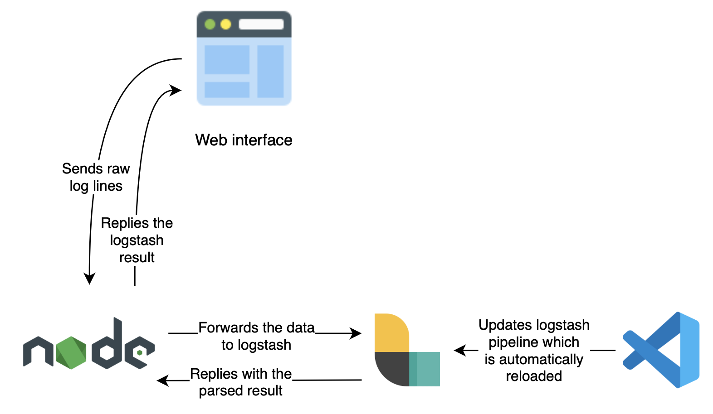

# Logstash Pipeline Tester

A tool to make it easy to test Logstash configurations, especially for users without extensive Linux knowledge. It provides a user-friendly interface for testing and validating Logstash pipelines.

## Quick Start

1. Clone the repository:
   ```bash
   git clone https://github.com/epacke/logstash-pipeline-tester.git
   cd logstash-pipeline-tester
   ```

2. Start the services:
   ```bash
   docker compose up
   ```

3. Access the web interface at `http://localhost:3000`

For detailed setup instructions, see:
- [Setup Guide](https://loadbalancing.se/2020/03/11/logstash-pipeline-tester/)
- [Video Tutorial](https://youtu.be/Q3IQeXWoqLQ)

*Note: The article is from 2020 but is continuously updated as needed.*

## Development Setup

To develop the application locally:

1. Find your machine's IP address:
   ```bash
   # Linux/macOS
   ifconfig
   # or
   ip addr
   
   # Windows
   ipconfig
   ```

2. Set the backend IP environment variable:
   ```bash
   export BACKEND_IP=192.168.1.10  # Replace with your actual IP
   ```

3. Start Logstash:
   ```bash
   BACKEND_ENDPOINT=http://${BACKEND_IP}:8080/api/v1/receiveLogstashOutput docker compose up logstash
   ```

4. Start the backend (in a new terminal):
   ```bash
   cd pipeline-ui/backend
   npm run dev
   ```

5. Start the frontend (in another terminal):
   ```bash
   cd pipeline-ui/frontend
   npm start
   ```

The application will automatically refresh when you make changes to the code.

## Contributing

Contributions are welcome! You can:
- Submit pull requests
- Share new pipeline configurations
- Report issues

If you're new to GitHub workflows, feel free to:
1. Create an issue describing your contribution
2. Contact me via https://loadbalancing.se/about/

## Architecture

<p align="center"></p>

## Screenshots

<p align="center"></p>

## Credits

- F5 Example pipeline adapted from [OutsideIT/logstash_filter_f5](https://github.com/OutsideIT/logstash_filter_f5)
- Icons/media:
  - [Log Wood Icon](https://www.svgrepo.com/svg/289194/log-wood)
  - [Wood Logs Vectors](https://www.vecteezy.com/free-vector/wood-logs) by Vecteezy
- SVG Optimization Tool: [Iconly SVG Cleaner](https://iconly.io/tools/svg-cleaner)
