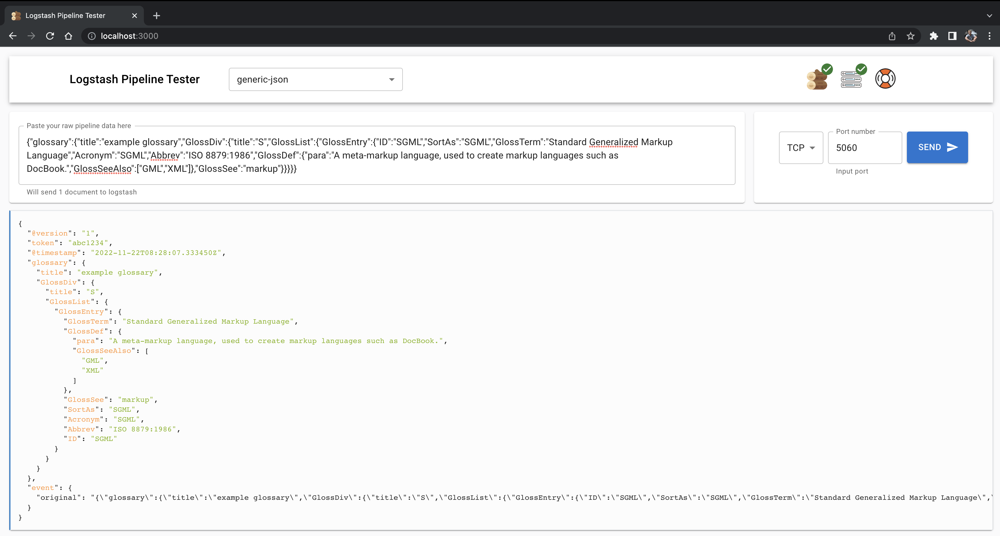

# About
This started out as a way to make it easy to test the logstash configuration for people without much linux know-how (and from my own frustration with how hard it was). Then it kind of grew into an interface, and here we are.

It's written fast and the code could use a bit of additional love, but it works fine.

## How to start
Documentation on how to get going is available here:
https://loadbalancing.se/2020/03/11/logstash-pipeline-tester/

There's also a video of how to get started here:
https://youtu.be/Q3IQeXWoqLQ

Article is dated 2020 but is continously updated whenever there is need to do so.

## Contributions
I gladly accept pull requests.

## Reporting issues
First, please check if there's any [current issues](https://github.com/epacke/logstash-pipeline-tester/issues) that matches your problem. If not, please feel free to submit an issue here at Github.

I have very limited time so I won't be able to act fast on any issue but it's always good to have it logged and who knows, maybe someone else will pick it up and make a PR.

# Application component diagram

# Screenshots

# Credits
* F5 Example pipeline copied (and slightly modified) from [here](https://github.com/OutsideIT/logstash_filter_f5)

## Icons/media
https://www.svgrepo.com/svg/289194/log-wood
<a href="https://www.vecteezy.com/free-vector/wood-logs">Wood Logs Vectors by Vecteezy</a>

## Great tool for cleaning up SVGs
https://iconly.io/tools/svg-cleaner
